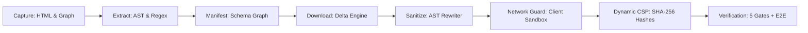

# Architecture & Technical Design: `realfood-mirror`

A strict, zero-data-exfiltration offline mirror and parity verification pipeline for modern Next.js web applications, designed for [`realfood.gov`](https://realfood.gov).

---

## 1. System Overview

`realfood-mirror` captures, sanitizes, and hosts a full offline replica of `realfood.gov` without leaking user traffic or metadata to third-party telemetry providers.

---

## 2. Core Architectural Pillars

### A. Client-Side Anti-Tamper Network Guard
The browser runtime is sealed against unauthorized telemetry egress by injecting `/stubs/network-guard.js` at the top of `<head>`:
- **Egress Interception**: Monkey-patches `window.fetch`, `XMLHttpRequest`, `navigator.sendBeacon`, `EventSource`, `WebSocket`, and `ServiceWorker` registration.
- **DOM Mutation Trapping**: Intercepts `Node.appendChild`, `Node.insertBefore`, and `Element.setAttribute` to block late-injected tracker `<script>` tags.
- **In-Memory Audit Buffer**: Records all trapped attempts in `window.__MIRROR_BLOCKED_REQUESTS__`.

### B. Dynamic Cryptographic CSP Hashes
To support Next.js React hydration without relaxing security:
1. `scripts/mirror/update-production-csp.mjs` computes SHA-256 digests for all inline script blocks.
2. Injects hashes into `vercel.json` and local server response headers.
3. Prohibits `unsafe-inline` and `unsafe-eval`.

### C. Multi-Tiered Parity Verification Engine
1. **Byte Parity (`verify-byte-parity.mjs`)**: Direct SHA-256 hash comparison between local files and live remote assets.
2. **DOM AST Parity (`verify-dom-parity.mjs`)**: Normalizes whitespace, nonces, and stub scripts before comparing structural DOM tree hashes.
3. **Network Egress Gate (`verify-network-gate.mjs`)**: Headless browser crawler asserting zero non-whitelisted HTTP requests.
4. **Visual Regression Gate (`compare-parity.mjs`)**: Multi-viewport Pixelmatch differential screenshot comparison across Desktop (1440x900) and Mobile (390x844).

---

## 3. Pipeline Stages

| Stage | Script | Purpose |
|---|---|---|
| 1. Capture HTML | `scripts/mirror/capture-html.mjs` | Fetches raw upstream entrypoint HTML |
| 2. Runtime Graph | `scripts/mirror/capture-runtime-graph.mjs` | Records dynamic Next.js network graph |
| 3. Static Refs | `scripts/mirror/extract-static-refs.mjs` | Extracts static assets from HTML & CSS |
| 4. Manifest | `scripts/mirror/build-manifest.mjs` | Unifies asset lists into schema-validated JSON |
| 5. Download | `scripts/mirror/download-assets.mjs` | Concurrent downloader with delta-caching |
| 6. Sanitize | `scripts/mirror/sanitize-third-party.mjs` | Strips PostHog/Cloudflare from JS chunks |
| 7. Sanity | `scripts/mirror/verify-sanity.mjs` | Enforces payload size & asset count invariants |
| 8. Rewrite | `scripts/mirror/rewrite-html.mjs` | AST HTML rewriter & Network Guard injector |
| 9. Dynamic CSP | `scripts/mirror/update-production-csp.mjs` | Calculates SHA-256 hashes for `vercel.json` |

---

## 4. Deployment Targets

- **Vercel Edge**: Production deployment with Edge Middleware (`middleware.js`), Serverless Telemetry Stubs (`api/stub.js`), and CSP Violation Sink (`api/csp-report.js`).
- **Docker / Container**: Air-gapped hardened Alpine Nginx container (`Dockerfile`, `docker-compose.yml`, `nginx.conf`).
- **Local Dev Server**: Zero-dependency Node.js HTTP static server (`scripts/mirror/serve-mirror.mjs`) with IP rate limiting and path traversal defenses.
