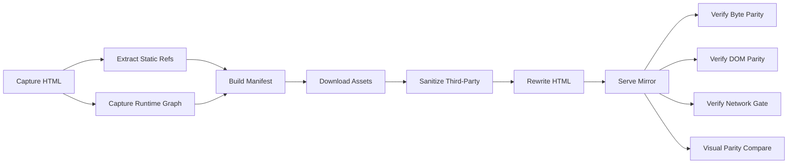

# realfood-mirror

A strict offline mirror pipeline for [realfood.gov](https://realfood.gov). Captures the live site, downloads all first-party assets, rewrites HTML for offline serving, and verifies byte-level, DOM-level, and pixel-level parity.

## Architecture



### Pipeline Stages

| Stage | Script | Purpose |
|-------|--------|---------|
| Capture | `capture-html.mjs` | Fetches raw HTML from the live site |
| Capture | `capture-runtime-graph.mjs` | Records runtime network requests via Playwright |
| Capture | `extract-static-refs.mjs` | Extracts asset URLs from HTML and CSS |
| Build | `build-manifest.mjs` | Merges all discovered URLs into a unified manifest |
| Build | `download-assets.mjs` | Downloads all assets (concurrent, with retry and incremental sync) |
| Build | `sanitize-third-party.mjs` | Strips third-party host references from JS/CSS bundles |
| Build | `rewrite-html.mjs` | Rewrites HTML for offline serving, injects network guard |
| Serve | `serve-mirror.mjs` | Static file server with CSP, rate limiting, path traversal protection |
| Verify | `verify-byte-parity.mjs` | SHA-256 comparison of local vs remote assets |
| Verify | `verify-dom-parity.mjs` | Normalized DOM hash comparison |
| Verify | `verify-network-gate.mjs` | Ensures zero disallowed external requests |
| Verify | `capture-parity.mjs` + `compare-parity.mjs` | Pixel-level visual comparison |

## Quick Start

```bash
# Install dependencies
npm install

# If assets are already in public/ — serve immediately
npm run serve

# Full pipeline: capture → build → serve
npm run mirror:refresh
npm run serve
```

## Commands

| Command | Description |
|---------|-------------|
| `npm run serve` | Start the mirror server on port 4173 |
| `npm run mirror:capture` | Capture HTML, runtime requests, and static refs from live site |
| `npm run mirror:build` | Build manifest, download assets, and rewrite HTML |
| `npm run mirror:refresh` | Full capture + build pipeline |
| `npm run mirror:verify` | Run all verification gates |
| `npm run test` | Run unit tests (Vitest) |
| `npm run test:e2e` | Run E2E tests (Playwright) |
| `npm run test:parity` | Run visual parity comparison |

## Configuration

All pipeline settings are centralized in [`mirror.config.mjs`](mirror.config.mjs):
- Source origin and CDN origin
- Blocked hosts list
- Manual URL inclusions
- Download concurrency and retry settings
- Server port and rate limiting
- Visual parity thresholds

## Security Model

The mirror server implements defense-in-depth:

1. **Nonce-based CSP** — No `unsafe-eval` or `unsafe-inline` for scripts. A per-start nonce is injected into all `<script>` tags.
2. **Network Guard** — Monkey-patches `fetch`, `XHR`, `sendBeacon`, `appendChild`, `insertBefore`, `setAttribute`, and `Worker` to block requests to disallowed hosts.
3. **Path Traversal Protection** — Uses `realpath()` to resolve filesystem paths and validates they remain under the public root.
4. **Rate Limiting** — Token-bucket per IP with configurable window and max requests.
5. **Security Headers** — `X-Content-Type-Options: nosniff`, `X-Frame-Options: DENY`, `Referrer-Policy: no-referrer`.

## Testing

```bash
# Unit tests (utilities, schema validation, DOM normalization)
npm run test

# E2E tests (requires mirror server running)
npm run test:e2e

# Full verification suite (starts server, runs all checks)
npm run mirror:verify
```

## Project Structure

```
├── mirror.config.mjs          # Centralized configuration
├── vitest.config.ts            # Unit test configuration
├── playwright.config.ts        # E2E test configuration
├── scripts/
│   ├── capture-parity.mjs      # Visual parity screenshot capture
│   ├── compare-parity.mjs      # Pixel-level comparison
│   └── mirror/
│       ├── lib/
│       │   ├── utils.mjs       # Shared utility functions
│       │   └── schema.mjs      # JSON schema validation
│       ├── capture-html.mjs
│       ├── capture-runtime-graph.mjs
│       ├── extract-static-refs.mjs
│       ├── build-manifest.mjs
│       ├── download-assets.mjs
│       ├── sanitize-third-party.mjs
│       ├── rewrite-html.mjs
│       ├── serve-mirror.mjs
│       ├── verify-all.mjs
│       ├── verify-byte-parity.mjs
│       ├── verify-dom-parity.mjs
│       └── verify-network-gate.mjs
├── tests/
│   ├── e2e/clone.spec.ts       # Playwright E2E tests
│   └── unit/
│       ├── utils.test.mjs      # Utility function tests
│       ├── schema.test.mjs     # Schema validation tests
│       └── dom-parity.test.mjs # DOM normalization tests
├── artifacts/                  # Pipeline intermediary artifacts
│   └── mirror/                 # Manifest, reports, source HTML
└── public/                     # Served static files
    ├── index.html              # Rewritten mirror HTML
    ├── stubs/                  # Network guard and noop stubs
    └── ...                     # Downloaded assets
```
