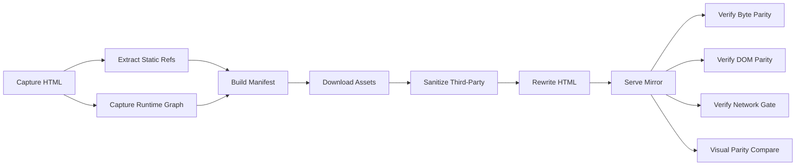

# realfood-mirror

A strict offline mirror pipeline for [realfood.gov](https://realfood.gov).

## Runtime Model

- Vercel deployment path is the production security source of truth.
- `scripts/mirror/serve-mirror.mjs` is a local development utility for offline checks.
- No `unsafe-eval` or `unsafe-inline` is allowed in deployed CSP.
- Compatibility rewrites for `/e` and `/decide` are intentionally removed.

## Pipeline

## Commands

| Command | Description |
|---|---|
| `npm run serve` | Start local mirror server |
| `npm run mirror:refresh` | Full capture + build pipeline |
| `npm run mirror:verify` | Run all verification gates |
| `npm run test:unit` | Run unit tests |
| `npm run test:e2e` | Run E2E tests (local default, deployed when `PREVIEW_URL` is set) |
| `npm run policy:check` | Verify canonical policy against `vercel.json`, README, and inline script hashes |
| `npm run check:tracked-generated` | Fail if generated artifact paths are tracked |
| `npm run ci:audit-report` | Run quality gates and emit machine-readable report |

## Security Model

Deployed policy is defined in `security/policy.mjs` and enforced in CI:

1. Strict CSP with explicit script hash allowlist and no unsafe script execution.
2. No public privileged control-plane endpoint (`/api/cron` removed).
3. No compatibility rewrites for legacy `/e` and `/decide` routes.
4. Defense headers include `X-Content-Type-Options`, `X-Frame-Options`, `Referrer-Policy`, `Permissions-Policy`, and cross-origin isolation headers.
5. `scripts/ci/check-security-policy.mjs` validates config, docs, and inline script hash coverage.

## Testing and Enforcement

- Unit tests include policy and contract checks under `tests/unit`.
- E2E tests validate route minimization, security headers, and network blocking semantics.
- CI blocks merges on typecheck, unit tests, policy checks, tracked artifact checks, dependency audit, and local/deployed E2E execution.

## Repository Hygiene

Generated output paths are intentionally not tracked:

- `artifacts/**`
- `playwright-report/**`
- `test-results/**`

CI enforces this with `scripts/ci/check-tracked-generated.mjs`.